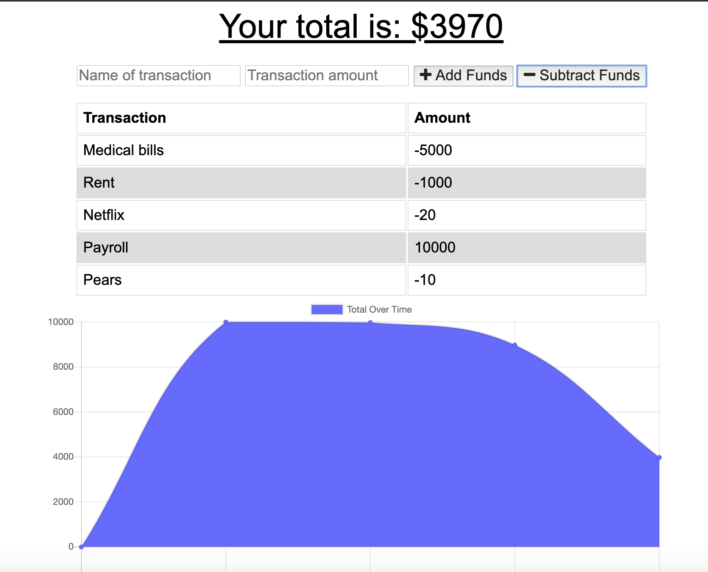

# Offline Budget Tracker
Is an app that works both online and offline, it can help you balance your recurring expenses and income. If you're on the go and might not always have access to the internet, you will now be able to balance your books both online and offline.

## User Story
AS AN avid traveller
I WANT to be able to track my withdrawals and deposits with or without a data/internet connection
SO THAT my account balance is accurate when I am traveling

## Business Context
Giving users a fast and easy way to track their money is important, but allowing them to access that information anytime is even more important. Having offline functionality is paramount to our applications success.

## Deployed App
[Link](http://offlinebudgets.herokuapp.com "to deployed app on Heroku")
